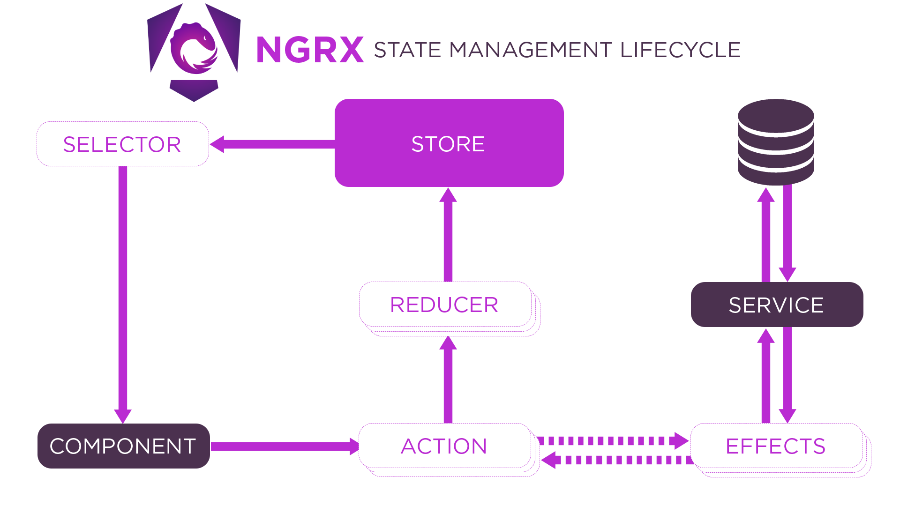

# NgRx

## What is NgRx?

**NgRx is a State Management Solution -> Aims to help with the management of more complex, (app-wide) state**

**State is data in components that changes over time (Button clicks) -> Changes should be reflected (in UI) -> May be used instead of managing complex state in components or services**

<br>

## Store

**Store - This is where your data is stored and managed**

**Selector used for communication between Store and Component**

**Component - This is where the data is needed and updates should be reflected**

Component can read data from the store ("listen to changes")

**Action - Standardized messages ("events") to which reducers can listen**

**Reducer - Contains state changing logic (e.g., incement counter by 1)**

**Effects - Side-effects that should be triggered for certain actions (e.g., send HTTP request)**

<br>



<hr>

## Installation

`ng add @ngrx/store`

## Store set up

### Reducer

Reducers are changing the data in the store, so if we want to setup initial data in store, we still need a reducer, because it is the thing that sets up the initial value and then potentionally changes it over time

Reducer is a function that takes some data as input and spits out the updated state

We have to create initial state variable:

`const initialState = 0; // Can be number/text/boolean/obj/array`

Then we create reducer with initialState:

`export const counterReducer = createReducer(initialState);`

So now, we can connect reducer to the store:

```
bootstrapApplication(AppComponent, {
  providers: [
    provideStore({ counter: counterReducer }),
    provideEffects([CounterEffects]),
  ],
});
```

counter - key (can be different / any key of your choice)
counterReducer - actual created and imported reducer

### Data read

To read data from store, we have to inject store and use Observables for variables:

```
export class CounterOutputComponent {
  count$: Observable<number>;
  doubleCount$: Observable<number>;

  constructor(private store: Store<{counter: number}>) {
    this.count$ = store.select(selectCount);
    this.doubleCount$ = store.select(selectDoubleCount);
  }
}
```

select function returns an Observable, thats why we need and Observable type for count$ variable
selectCount is key of reducer or typically a selector:

```
export const selectCount = (state: { counter: number }) => state.counter;
```

So as its an Observable, we use async pipe in template to setup automatic listener to the Observable that will update the part of UI whenever the Observable changes:

`<p class="counter">{{ count$ | async }}</p>`

### Actions

Using NgRx, you do not call reducers by yourself, instead you dispatch actions, so NgRx can call reducers for you, so reducers can work on latest state that is managed by NgRx and update it accordinglly

Actions

```
export const increment = createAction(
  '[Counter] Increment'
);
```

`[Counter]` - The id for the feature of the app to which action belongs
Increment - The actual action id

Now we can use action in the reducer:

```
export const counterReducer = createReducer(
  initialState,
  on(increment, (state, action) => state + action.value),
  on(decrement, (state, action) => state - action.value),
  on(set, (state, action) => action.value),
);
```

**action is optional if action contains additional attached data in it**

Now we need to dispatch actions:

```
export class CounterControlsComponent {
  constructor(private store: Store) {}

  increment() {
    this.store.dispatch(increment({ value: 2 }));
  }

  decrement() {
    this.store.dispatch(decrement({ value: 2 }));
  }
}
```

increment/decrement are the functions that should be executed when dispatching

### Data attachment to actions

Dynamic actions which carry data are possible:

```
export const increment = createAction(
  '[Counter] Increment',
  props<{value: number}>()
);
```

Execute props() function, which is generic function so we add <> brackets to describe kind of data

value - Key with optional name

<hr>

Alternative way (if used without createAction):

```
export const INCREMENT = '[Counter] Increment'

export class IncrementAction implements Action {
 readonly type = INCREMENT;

  constructor(public value: number) {}
}

export type CounterActions = IncrementAction;
```

<hr>

Alternative way of creating reducers for older versions:

```
 export function counterReducer(state = initialState, action: CounterActions | Action) {
   if (action.type === INCREMENT) {
     return state + (action as IncrementAction).value;
   }
   return state;
 }
```

<hr>

### Selectors

Selector - function that will get state value as a whole NgRx store state, and shape is the shape of the overall store. The function returns value to select

`export const selectCount = (state: { counter: number }) => state.counter;
`

If you change state value selection logic or state value, you do not need to go for all places to change it. So it is centralized now.

<br>

You can define multiple selectors

You can create selector based on existing selector

```
export const selectDoubleCount = createSelector(
  selectCount,
  (state) => state * 2
);
```

### Effects

Side Effect - Anything that is not directly related to an immediate UI update (HTTP Request, localStorage, Logging to the console)

As reducers cannot use async functions, we do async functions using side effects

<hr>

Installation:

`ng add @ngrx/effects`

<br>

Effect creation:

```
@Injectable()
export class CounterEffects {
saveCount = createEffect(
    () =>
      this.actions$.pipe(
        ofType(increment, decrement),
        withLatestFrom(this.store.select(selectCount)),
        tap(([action, counter]) => {
          console.log(action);
          localStorage.setItem('count', counter.toString());
        })
      ),
    { dispatch: false }
  );
}

constructor(
    private actions$: Actions,
    private store: Store<{ counter: number }>
  ) {}

```

ofType() - Defines which actions we want to execute some code (filtering)

withLatestFrom() - Allows to pass some value to operator which is then available in the next operator in the pipe line

tap() - Register a function that will be executed that will not yeld a new Observable once its done

{ dispatch: false } - If effect does not dispatch a new action once its done

and after that we register created effect in main.ts

```
bootstrapApplication(AppComponent, {
  providers: [
    provideStore({ counter: counterReducer }),
    provideEffects([CounterEffects]),
  ],
});
```

**_In older version @Effect was used_**
